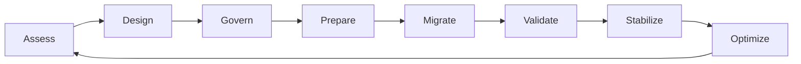

# Enterprise Jira Transformation Framework

> A practical, enterprise-grade framework for assessing, governing, consolidating, migrating, and continuously improving Jira environments at scale.

**Enterprise Program Leadership Series — Volume I**

---

## Executive Summary

Enterprise Jira transformation is not merely a platform migration. It is a redesign of how an organization plans work, governs delivery, manages operational risk, measures performance, and produces trusted executive insight.

As Jira environments grow, they commonly accumulate duplicated workflows, fragmented reporting, inconsistent configurations, unmanaged automation, and unclear ownership. These conditions increase administrative effort, weaken data quality, and make change progressively harder.

This repository provides an organization-neutral, reusable body of guidance for leaders and practitioners who need to simplify Jira ecosystems, control migration risk, establish sustainable governance, and create measurable operational value.

## Featured Interactive Experience

### [Launch the Enterprise Analytics Dashboard Gallery](dashboard-gallery/index.html)

Explore five interactive, synthetic dashboard concepts covering executive portfolio health, sprint governance, JSM operations, transformation governance, and FinOps. The gallery demonstrates how governed KPI definitions become decision-ready reports.

See the [Enterprise Metrics and Dashboard Library](docs/Metrics-Library.md) for formulas, ownership, interpretation, drill-down guidance, and the dashboard operating model.

## Why This Repository Exists

Many Jira environments evolve through local optimization. Individual teams create workflows, fields, schemes, dashboards, and automation to solve immediate needs. Over time, those decisions can produce enterprise-wide complexity.

Typical symptoms include:

- workflow and scheme proliferation;
- duplicate or poorly governed custom fields;
- conflicting automation rules;
- inconsistent issue lifecycles and reporting definitions;
- fragmented permissions and ownership;
- unreliable executive dashboards;
- rising administrative and support effort;
- migration risk caused by undocumented dependencies.

This framework helps organizations move from an ad hoc platform to a governed, measurable, and continuously improving operating model.

## What This Repository Provides

The repository combines executive guidance, decision frameworks, playbooks, runbooks, interactive dashboard concepts, and reusable templates covering:

- current-state assessment;
- target operating model design;
- configuration and workflow rationalization;
- governance and decision rights;
- migration planning and execution;
- cutover, rollback, and validation controls;
- platform health and transformation metrics;
- executive, engineering, operations, transformation, and FinOps dashboards;
- AI-assisted analysis and governance opportunities.

## Intended Audience

- Program and transformation leaders
- Technical program managers
- PMO and portfolio leaders
- Jira and Atlassian platform owners
- Enterprise and solution architects
- Engineering and service-management leaders
- Platform engineering and operations teams
- Migration and operational-readiness teams
- Analytics and business-intelligence practitioners

## Transformation Lifecycle

| Phase | Leadership Question | Primary Outcome |
|---|---|---|
| Assess | What complexity and risk exist today? | Evidence-based current-state baseline |
| Design | What operating model should replace it? | Target architecture and principles |
| Govern | Who decides, approves, and owns change? | Decision rights and control model |
| Prepare | Are dependencies, data, and teams ready? | Approved migration and readiness plan |
| Migrate | How will change be executed safely? | Controlled implementation |
| Validate | Did the platform and business processes work? | Verified technical and operational outcomes |
| Stabilize | Are defects, adoption, and support controlled? | Predictable transition to operations |
| Optimize | How will value and health improve over time? | Continuous-improvement backlog and metrics |

## Guiding Principles

1. **Business outcomes before platform activity** — Every change should support a measurable operational or strategic objective.
2. **Standardize before automating** — Automation scales both good and bad process design.
3. **Configure once, reuse many times** — Shared patterns reduce maintenance cost and reporting variance.
4. **Govern through explicit decision rights** — High-impact changes require accountable ownership and evidence.
5. **Design for reversibility** — Migration and cutover plans must include objective rollback triggers.
6. **Measure value and platform health** — Completion is not success unless outcomes improve.
7. **Preserve human accountability** — AI and automation may assist decisions but should not obscure ownership or auditability.

## Repository Navigation

| Area | Purpose |
|---|---|
| [`docs/`](docs/) | Executive frameworks, governance guidance, decision models, metrics, and reference material |
| [`dashboard-gallery/`](dashboard-gallery/) | Interactive sample dashboards and visual reporting guidance |
| [`playbooks/`](playbooks/) | Repeatable methods for consolidation and transformation planning |
| [`runbooks/`](runbooks/) | Operational procedures for migration, cutover, rollback, and validation |
| [`registers/`](registers/) | Reusable inventories and dependency matrices using synthetic data only |
| [`wiki/`](wiki/) | Supporting knowledge and navigation content |

### Start Here

1. [Enterprise Jira Transformation Framework](docs/Enterprise-Jira-Transformation-Framework.md)
2. [Enterprise Jira Governance Model](docs/Governance-Model.md)
3. [Enterprise Metrics and Dashboard Library](docs/Metrics-Library.md)
4. [Interactive Enterprise Analytics Dashboard Gallery](dashboard-gallery/index.html)
5. [Consolidation Playbook](playbooks/consolidation-playbook.md)
6. [Migration Runbook](playbooks/migration-runbook.md)
7. [Cutover Checklist](runbooks/cutover_checklist.md)
8. [Rollback Plan](runbooks/rollback_plan.md)

## Executive Success Measures

A transformation should demonstrate improvement across both platform health and business operations.

| Dimension | Example Measures |
|---|---|
| Simplification | Workflow reduction, custom-field reduction, scheme reuse |
| Governance | Approval compliance, ownership coverage, audit findings |
| Reliability | Automation success rate, migration defect rate, rollback frequency |
| Productivity | Administrative effort, onboarding time, cycle-time improvement |
| Data quality | Required-field completeness, reporting consistency, reconciliation defects |
| Adoption | Standard-template usage, training completion, user satisfaction |
| Executive insight | KPI definition consistency, dashboard trust, reporting latency |

## Decision Quality Standard

Recommendations in this repository should explain:

- why the approach is recommended;
- when an alternative may be preferable;
- the trade-offs and risks involved;
- the evidence required before proceeding;
- how success will be measured.

The goal is not to prescribe one universal configuration. It is to improve the quality, transparency, and repeatability of enterprise decisions.

## AI-Assisted Transformation

AI can accelerate analysis and documentation when used with appropriate data controls and human review. Practical opportunities include:

- detecting duplicate or semantically similar configurations;
- summarizing workflow and dependency inventories;
- generating draft JQL and validation scenarios;
- identifying governance drift and migration risks;
- producing executive status summaries from approved data;
- supporting documentation quality and completeness checks.

AI-generated recommendations should remain explainable, reviewable, and subject to accountable approval.

## Data and Confidentiality Policy

This repository contains only generalized guidance, placeholders, fictional scenarios, and synthetic datasets. It must not include employer, customer, employee, product, tenant, project, financial, security, credential, incident, or proprietary organizational information.

Real Jira URLs, project keys, issue IDs, field IDs, user names, automation identifiers, screenshots, exports, and internal configurations are prohibited.

Read [PORTFOLIO_DATA_POLICY.md](PORTFOLIO_DATA_POLICY.md) before contributing or publishing an artifact.

## Current Release Status

The repository is being developed as a reference-quality knowledge product. Existing artifacts may vary in maturity while the executive framework, playbooks, runbooks, templates, diagrams, dashboard prototypes, and cross-references are expanded.

## Contributing

Contributions should preserve the following standards:

- organization-neutral content;
- synthetic examples and configurable placeholders;
- explicit purpose, scope, ownership, controls, and outputs;
- measurable validation and success criteria;
- clear trade-offs and decision guidance;
- accessible, professional writing.

## License

Licensing terms will be added before public release. Until then, reuse should be treated as restricted to repository review and development.
