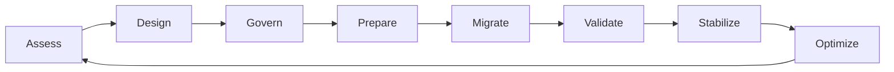

# Enterprise Jira Transformation Framework

> A practical, enterprise-grade framework for assessing, governing, consolidating, migrating, and continuously improving Jira environments at scale.

**Enterprise Program Leadership Series — Volume I**

[Launch the live Executive Analytics Portal](https://nagulapallikranthi.github.io/jira-transformation/) · [Explore the Metrics Library](docs/Metrics-Library.md) · [Review the Framework](docs/Enterprise-Jira-Transformation-Framework.md)

---

## Executive Overview

Enterprise Jira transformation is not merely a platform migration. It is a redesign of how an organization plans work, governs delivery, manages operational risk, measures performance, and produces trusted executive insight.

As Jira environments grow, they commonly accumulate duplicated workflows, fragmented reporting, inconsistent configurations, unmanaged automation, and unclear ownership. These conditions increase administrative effort, weaken data quality, and make change progressively harder.

This public repository provides an organization-neutral knowledge product for leaders and practitioners who need to simplify Jira ecosystems, control migration risk, establish sustainable governance, and create measurable operational value.

## Choose Your Path

| Goal | Start Here | Outcome |
|---|---|---|
| View executive reporting | [Live Executive Analytics Portal](https://nagulapallikranthi.github.io/jira-transformation/) | Explore decision-ready portfolio, sprint, JSM, transformation, and FinOps views |
| Understand the transformation model | [Enterprise Jira Transformation Framework](docs/Enterprise-Jira-Transformation-Framework.md) | Learn the lifecycle, principles, and decision model |
| Establish governance | [Enterprise Jira Governance Model](docs/Governance-Model.md) | Define ownership, controls, decision rights, and review cadence |
| Standardize measurement | [Enterprise Metrics and Dashboard Library](docs/Metrics-Library.md) | Define formulas, thresholds, ownership, and dashboard behavior |
| Plan consolidation | [Consolidation Playbook](playbooks/consolidation-playbook.md) | Build an evidence-based rationalization approach |
| Execute migration | [Migration Runbook](playbooks/migration-runbook.md) | Plan and control migration activities |
| Prepare cutover and recovery | [Cutover Checklist](runbooks/cutover_checklist.md) and [Rollback Plan](runbooks/rollback_plan.md) | Establish readiness, validation, and recovery controls |

## Live Analytics Experience

The public GitHub Pages site currently presents five interactive dashboard prototypes:

- Executive Portfolio
- Sprint Governance
- JSM Operations
- Transformation Governance
- FinOps

All programs, services, teams, financial figures, and operational values are synthetic. The dashboards demonstrate information architecture and decision patterns rather than production performance.

[Open the live dashboard gallery](https://nagulapallikranthi.github.io/jira-transformation/) or review its [implementation notes](dashboard-gallery/README.md).

## What the Framework Covers

The repository combines executive guidance, decision frameworks, playbooks, runbooks, interactive dashboard concepts, and reusable templates covering:

- current-state assessment;
- target operating model design;
- configuration and workflow rationalization;
- governance and decision rights;
- migration planning and execution;
- cutover, rollback, reconciliation, and validation controls;
- platform health and transformation metrics;
- executive, engineering, operations, transformation, and FinOps analytics;
- AI-assisted analysis and governance opportunities.

## Intended Audience

- CIO, CTO, and technology executives
- Program and transformation leaders
- PMO and portfolio leaders
- Jira and Atlassian platform owners
- Enterprise and solution architects
- Engineering and service-management leaders
- Platform engineering and operations teams
- Migration and operational-readiness teams
- Analytics and business-intelligence practitioners

## Transformation Lifecycle



| Phase | Leadership Question | Primary Outcome |
|---|---|---|
| Assess | What complexity and risk exist today? | Evidence-based current-state baseline |
| Design | What operating model should replace it? | Target architecture and principles |
| Govern | Who decides, approves, and owns change? | Decision rights and control model |
| Prepare | Are dependencies, data, and teams ready? | Approved migration and readiness plan |
| Migrate | How will change be executed safely? | Controlled implementation |
| Validate | Did the platform and business processes work? | Verified technical and operational outcomes |
| Stabilize | Are defects, adoption, and support controlled? | Predictable transition to operations |
| Optimize | How will value and health improve over time? | Continuous-improvement backlog and metrics |

## Guiding Principles

1. **Business outcomes before platform activity** — Every change should support a measurable operational or strategic objective.
2. **Standardize before automating** — Automation scales both good and bad process design.
3. **Configure once, reuse many times** — Shared patterns reduce maintenance cost and reporting variance.
4. **Govern through explicit decision rights** — High-impact changes require accountable ownership and evidence.
5. **Design for reversibility** — Migration and cutover plans must include objective rollback triggers.
6. **Measure value and platform health** — Completion is not success unless outcomes improve.
7. **Preserve human accountability** — AI and automation may assist decisions but should not obscure ownership or auditability.

## Information Architecture

The repository and public portal follow a common navigation model:

```text
Home | Framework | Analytics | Governance | Playbooks | Runbooks | Reference | Roadmap
```

| Blueprint | Purpose |
|---|---|
| [Site Map](docs/Site-Map.md) | Defines public sections, audience journeys, and planned portal hierarchy |
| [Repository Structure](docs/Repository-Structure.md) | Defines folder responsibilities, placement rules, and target growth model |
| [Documentation Standards](docs/Documentation-Standards.md) | Defines writing, metrics, dashboard, technical-example, and review standards |
| [Navigation Model](docs/Navigation-Model.md) | Defines how visitors move between the live portal, repository, and implementation artifacts |

## Repository Navigation

| Area | Purpose |
|---|---|
| [`dashboard-gallery/`](dashboard-gallery/) | Live executive analytics experience and interactive reporting prototypes |
| [`docs/`](docs/) | Executive frameworks, governance guidance, architecture, metrics, and reference material |
| [`playbooks/`](playbooks/) | Repeatable methods for assessment, consolidation, and transformation planning |
| [`runbooks/`](runbooks/) | Controlled procedures for migration, cutover, rollback, and validation |
| [`registers/`](registers/) | Reusable inventories and dependency matrices using synthetic data only |
| [`wiki/`](wiki/) | Supporting knowledge and navigation content |

## Executive Success Measures

A transformation should demonstrate improvement across both platform health and business operations.

| Dimension | Example Measures |
|---|---|
| Simplification | Workflow reduction, custom-field reduction, scheme reuse |
| Governance | Approval compliance, ownership coverage, audit findings |
| Reliability | Automation success rate, migration defect rate, rollback frequency |
| Productivity | Administrative effort, onboarding time, cycle-time improvement |
| Data quality | Required-field completeness, reporting consistency, reconciliation defects |
| Adoption | Standard-template usage, training completion, user satisfaction |
| Executive insight | KPI definition consistency, dashboard trust, reporting latency |

## Decision Quality Standard

Recommendations in this repository should explain:

- why the approach is recommended;
- when an alternative may be preferable;
- the trade-offs and risks involved;
- the evidence required before proceeding;
- how success will be measured.

The goal is not to prescribe one universal configuration. It is to improve the quality, transparency, and repeatability of enterprise decisions.

## AI-Assisted Transformation

AI can accelerate analysis and documentation when used with appropriate data controls and human review. Practical opportunities include:

- detecting duplicate or semantically similar configurations;
- summarizing workflow and dependency inventories;
- generating draft JQL and validation scenarios;
- identifying governance drift and migration risks;
- producing executive status summaries from approved data;
- supporting documentation quality and completeness checks.

AI-generated recommendations should remain explainable, reviewable, and subject to accountable approval.

## Data and Confidentiality Policy

This repository contains only generalized guidance, placeholders, fictional scenarios, and synthetic datasets. It must not include employer, customer, employee, product, tenant, project, financial, security, credential, incident, or proprietary organizational information.

Real Jira URLs, project keys, issue IDs, field IDs, user names, automation identifiers, screenshots, exports, and internal configurations are prohibited.

Read [PORTFOLIO_DATA_POLICY.md](PORTFOLIO_DATA_POLICY.md) before contributing or publishing an artifact.

## Current Release Status

The live executive dashboard is available as a public prototype. The broader framework remains under active development while playbooks, runbooks, templates, technical examples, synthetic datasets, and the documentation portal are expanded.

Content maturity is identified as Concept, Draft, Reference, Template, or Prototype according to the [Documentation Standards](docs/Documentation-Standards.md).

## Contributing

Contributions should preserve:

- organization-neutral content;
- synthetic examples and configurable placeholders;
- explicit purpose, scope, ownership, controls, and outputs;
- measurable validation and success criteria;
- clear trade-offs and decision guidance;
- accessible, professional writing.

Formal contribution guidance and community files are planned for the next public-readiness release.

## License

A public-use license is not yet attached. Until a license is added, the repository is publicly viewable but reuse and redistribution rights are not granted automatically.
