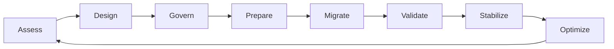

# Enterprise Jira Transformation Framework

> A practical, organization-neutral framework for assessing, governing, consolidating, migrating, measuring, and continuously improving Jira environments at enterprise scale.

**Enterprise Program Leadership Series — Volume I**

## Launch the live experience

### [Open the Enterprise Analytics Dashboard Gallery](https://nagulapallikranthi.github.io/jira-transformation/)

Explore interactive synthetic dashboards for executive portfolio health, sprint governance, JSM operations, transformation governance, and FinOps. The gallery demonstrates how governed metrics can become decision-ready reporting without exposing organizational information.

## Documentation portal

### [Open the structured documentation portal](docs/Portal-Home.md)

Use the portal to navigate by role across the framework, governance, architecture, analytics, technical implementation, migration assets, project status, FAQ, and glossary.

## Choose your path

| Goal | Start here |
|---|---|
| Understand the transformation lifecycle | [Enterprise Jira Transformation Framework](docs/Enterprise-Jira-Transformation-Framework.md) |
| Establish decision rights and controls | [Governance Model](docs/Governance-Model.md) |
| Understand the target architecture | [Enterprise Reference Architecture](docs/Enterprise-Reference-Architecture.md) |
| Define trusted KPIs | [Governed KPI Catalogue](analytics/KPI-Catalogue.md) |
| Specify decision-ready dashboards | [Dashboard Specification Standard](analytics/Dashboard-Specification-Standard.md) |
| Implement Jira analytics in Power BI | [Power BI Implementation Guide](docs/Power-BI-Implementation-Guide.md) |
| Use reusable Jira queries | [Baseline JQL Library](technical-libraries/jql/Baseline-JQL-Library.md) |
| Plan consolidation or migration | [Consolidation Playbook](playbooks/consolidation-playbook.md) and [Migration Runbook](playbooks/migration-runbook.md) |
| Prepare cutover and rollback | [Cutover Checklist](runbooks/cutover_checklist.md) and [Rollback Plan](runbooks/rollback_plan.md) |
| Find definitions and answers | [Glossary](docs/Glossary.md) and [FAQ](docs/FAQ.md) |
| Contribute content safely | [Contributing Guide](CONTRIBUTING.md) and [Data Policy](PORTFOLIO_DATA_POLICY.md) |
| Review delivery maturity | [Baseline Delivery Status](docs/Baseline-Status.md) and [Roadmap](ROADMAP.md) |

## Why this repository exists

Enterprise Jira transformation is not merely a platform migration. It is a redesign of how an organization plans work, governs delivery, controls operational risk, manages platform complexity, and produces trusted executive insight.

Jira environments often grow through local optimization. Teams create workflows, schemes, fields, automation, reports, and integrations for immediate needs. Over time, this can produce duplicated configuration, inconsistent lifecycles, unclear ownership, fragile automation, weak data quality, and unreliable executive reporting.

This repository provides a reusable public reference for moving from an ad hoc environment to a governed, measurable, and continuously improving operating model.

## What the framework provides

- current-state assessment and target operating-model guidance;
- workflow, field, scheme, permission, and automation rationalization;
- governance, ownership, decision rights, and exception management;
- dependency discovery, migration-wave planning, cutover, rollback, and hypercare;
- executive, program, sprint, JSM, DevOps, FinOps, and transformation analytics;
- governed KPI definitions, dashboard specifications, and reporting controls;
- Power BI architecture, semantic-model, refresh, security, and reconciliation guidance;
- reusable JQL and expanding SQL, MDX, DAX, REST, automation, and Python libraries;
- reusable templates, technical examples, and synthetic datasets;
- explainable, auditable AI-assistance patterns with human accountability.

## Intended audience

The framework is designed for CIO and CTO organizations, PMO and portfolio leaders, program managers, Jira and Atlassian platform owners, enterprise architects, engineering and operations leaders, service-management teams, migration teams, Power BI developers, and analytics practitioners.

## Transformation lifecycle

| Phase | Leadership question | Primary outcome |
|---|---|---|
| Assess | What complexity, risk, and value opportunities exist? | Evidence-based baseline |
| Design | What operating model and architecture should replace the current state? | Target design and principles |
| Govern | Who decides, approves, owns, and measures change? | Decision rights and controls |
| Prepare | Are dependencies, data, environments, and teams ready? | Approved readiness plan |
| Migrate | How will change be executed safely and traceably? | Controlled implementation |
| Validate | Did technical and business processes work as intended? | Verified outcomes |
| Stabilize | Are defects, adoption, and support controlled? | Predictable operational transition |
| Optimize | How will value and platform health improve continuously? | Prioritized improvement backlog |

## Guiding principles

1. **Business outcomes before platform activity.**
2. **Standardize before automating.**
3. **Configure once and reuse deliberately.**
4. **Govern through explicit decision rights.**
5. **Design migrations for reversibility.**
6. **Measure value, reliability, and platform health.**
7. **Preserve human accountability for AI-assisted decisions.**
8. **Publish synthetic examples only.**

## Repository map

| Area | Purpose |
|---|---|
| [`dashboard-gallery/`](dashboard-gallery/) | Live interactive dashboard prototype |
| [`docs/`](docs/) | Frameworks, governance, metrics, architecture, standards, portal, and reference guidance |
| [`analytics/`](analytics/) | Governed KPI catalogue and dashboard specification standards |
| [`playbooks/`](playbooks/) | Repeatable transformation and consolidation methods |
| [`runbooks/`](runbooks/) | Operational migration, cutover, rollback, validation, and stabilization procedures |
| [`registers/`](registers/) | Reusable inventories and dependency matrices using synthetic data |
| [`templates/`](templates/) | Editable governance, planning, readiness, and reporting templates |
| [`datasets/`](datasets/) | Synthetic datasets and data dictionaries |
| [`technical-libraries/`](technical-libraries/) | JQL, SQL, MDX, DAX, REST, automation, and Python implementation examples |
| [`wiki/`](wiki/) | Supporting knowledge and navigation content |

See [Repository Structure](docs/Repository-Structure.md) for placement and naming rules.

## Decision-quality standard

Recommendations should state the purpose, assumptions, recommended approach, alternatives, risks, controls, ownership, evidence required, validation method, and measurable success criteria. The framework does not prescribe one universal Jira configuration; it improves the quality and repeatability of enterprise decisions.

## Public-data and confidentiality policy

This repository contains generalized guidance, fictional scenarios, placeholders, and synthetic datasets only. Do not publish employer, customer, employee, tenant, product, project, incident, financial, security, credential, or proprietary information.

Real Jira URLs, project keys, issue IDs, field IDs, account IDs, user names, automation identifiers, screenshots, and exports are prohibited. Read [PORTFOLIO_DATA_POLICY.md](PORTFOLIO_DATA_POLICY.md) before contributing.

## Project status

Baseline v1.0 is actively being built against an explicit rule: every major area must reach at least 85% maturity before the baseline is declared complete. The current weighted maturity is approximately **62%**, with the framework, governance, architecture, documentation navigation, and dashboard standards at or near the target threshold. Technical libraries, synthetic datasets, downloadable assets, and AI examples remain the largest workstreams.

Track exact area-level maturity through [Baseline Delivery Status](docs/Baseline-Status.md), [Roadmap](ROADMAP.md), and [Changelog](CHANGELOG.md).

## Contributing and security

Contributions are welcome when they follow the [Contributing Guide](CONTRIBUTING.md), [Documentation Standards](docs/Documentation-Standards.md), [Code of Conduct](CODE_OF_CONDUCT.md), and public-data policy.

Do not disclose vulnerabilities, credentials, or confidential information in public issues. Follow [SECURITY.md](SECURITY.md) for private reporting guidance.

## License

Licensed under the [Apache License 2.0](LICENSE). You may use, modify, and distribute the content in accordance with the license and required notices. Atlassian, Jira, Jira Service Management, and other product names are trademarks of their respective owners; this independent project is not endorsed by or affiliated with Atlassian.