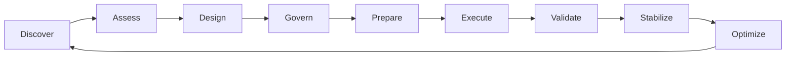

# Enterprise Jira Transformation Framework

**Version 1.0**  
**Enterprise Program Leadership Series — Volume I**

## Executive Summary

Enterprise Jira transformation is a business and operating-model change enabled by platform modernization. It affects how work is structured, how delivery is governed, how risks are surfaced, how teams collaborate, and how leaders trust operational data.

A successful transformation does more than move configurations between environments. It reduces unnecessary complexity, establishes decision rights, protects business continuity, improves data quality, and creates a platform that can evolve without repeatedly accumulating the same technical and governance debt.

This framework provides a structured methodology for assessing, designing, governing, executing, validating, and continuously improving enterprise Jira environments.

## Business Context

Jira environments commonly grow through decentralized decisions. Teams introduce new workflows, fields, schemes, automations, permissions, and dashboards to meet local needs. Individually, these choices may be reasonable. Collectively, they can create a platform that is expensive to administer, difficult to migrate, and unreliable as a source of enterprise insight.

Typical indicators include:

- duplicated workflows and schemes;
- overlapping or unused custom fields;
- inconsistent issue-type and status models;
- unmanaged automation dependencies;
- fragmented access and permission structures;
- conflicting KPI definitions;
- dashboard proliferation;
- undocumented integrations;
- unclear ownership and approval paths;
- weak rollback and validation discipline.

Transformation should therefore be treated as operational modernization, not as a narrow technical migration.

## Transformation Outcomes

A successful program should improve:

| Outcome | Expected Change |
|---|---|
| Simplicity | Fewer redundant configurations and exceptions |
| Governance | Clear ownership, standards, approvals, and auditability |
| Reliability | Predictable migration, automation, and platform operations |
| Scalability | Reusable patterns that support organizational growth |
| Data quality | Consistent structures and trusted reporting |
| Productivity | Lower administrative effort and less process friction |
| Transparency | Better operational and executive visibility |
| Adaptability | Controlled evolution without governance regression |

## Guiding Principles

### 1. Business Outcomes Before Platform Activity

Every configuration change should support a defined business, operational, compliance, or user outcome.

### 2. Standardize Before Automating

Automation should scale approved process design. Automating inconsistent processes increases complexity and makes governance harder.

### 3. Reuse Before Customization

Shared workflows, schemes, templates, and reporting definitions should be the default. Exceptions require documented value and ownership.

### 4. Evidence Before Migration

Migration scope and sequencing should be based on inventory, dependency mapping, usage evidence, and risk—not assumptions.

### 5. Reversibility by Design

Cutover plans should define rollback triggers, decision authority, recovery steps, and validation criteria before execution begins.

### 6. Governance as an Operating Capability

Governance must continue after migration through recurring reviews, platform health metrics, and controlled change processes.

### 7. Human Accountability for Automated Decisions

AI and automation may assist analysis and execution, but accountable owners must remain visible and decisions must remain auditable.

## Transformation Lifecycle

| Phase | Purpose | Exit Evidence |
|---|---|---|
| Discover | Build a complete inventory and stakeholder map | Approved scope and inventory baseline |
| Assess | Determine complexity, risk, value, and dependencies | Current-state assessment and risk profile |
| Design | Define target architecture and operating model | Approved target-state design |
| Govern | Establish decision rights, standards, and controls | Governance charter and approval model |
| Prepare | Ready data, tooling, teams, communications, and support | Readiness review and go/no-go evidence |
| Execute | Perform configuration, data, and process migration | Controlled implementation records |
| Validate | Confirm technical, functional, reporting, and security outcomes | Signed validation results |
| Stabilize | Resolve defects and transition ownership to operations | Operational acceptance |
| Optimize | Improve health, adoption, and value using measured evidence | Prioritized improvement backlog |

## Current-State Assessment

The assessment should cover both technical configuration and operational behavior.

### Platform Configuration

- projects and project types;
- workflows and workflow schemes;
- issue types and issue-type schemes;
- screens and screen schemes;
- custom fields and contexts;
- notification and permission schemes;
- automation rules;
- dashboards, filters, and subscriptions.

### Usage and Data

- active versus dormant projects;
- configuration usage frequency;
- data completeness and validity;
- issue volumes and growth;
- reporting dependencies;
- historical retention needs;
- data residency and compliance requirements.

### Integrations and Dependencies

- identity and access management;
- CI/CD and source-control integrations;
- collaboration and documentation platforms;
- monitoring and incident-management systems;
- reporting, analytics, and data pipelines;
- marketplace applications;
- external APIs and webhooks.

### Operating Model

- platform ownership;
- administrative access;
- change approval;
- support and escalation;
- governance cadence;
- training and adoption;
- vendor and licensing management.

## Target Operating Model

The target operating model should define:

- platform ownership and accountability;
- governance forums and decision rights;
- standard configuration patterns;
- exception-management process;
- support tiers and escalation paths;
- release and change-management cadence;
- reporting ownership and KPI definitions;
- health monitoring and continuous improvement.

## Migration Strategy Decision Framework

| Strategy | Prefer When | Avoid When | Primary Trade-off |
|---|---|---|---|
| Big bang | Scope is small, dependencies are limited, and rollback is simple | Business units are highly dependent or outage tolerance is low | Speed versus concentrated risk |
| Phased | Scope is large, domains can be isolated, and learning should influence later waves | Cross-domain dependencies prevent clean sequencing | Lower risk versus longer duration |
| Parallel run | Reporting or operational continuity requires comparison before cutover | Duplicate operation creates unacceptable effort or data conflict | Confidence versus operational overhead |
| Hybrid | Different domains have materially different risk and readiness profiles | Governance cannot manage multiple execution patterns | Flexibility versus coordination complexity |

## Governance and Decision Rights

The program should explicitly assign authority for:

- target-state architecture;
- configuration standards;
- migration scope and sequencing;
- exception approval;
- data retention and deletion;
- security and permissions;
- go/no-go and rollback decisions;
- operational acceptance;
- KPI and reporting definitions.

See [Enterprise Jira Governance Model](Governance-Model.md) for the detailed operating model.

## Readiness Model

Migration should not proceed until evidence exists across these dimensions:

| Dimension | Minimum Evidence |
|---|---|
| Scope | Approved inventory and inclusion/exclusion criteria |
| Dependencies | Validated integration and configuration dependency map |
| Data | Quality profile, reconciliation method, and retention rules |
| Security | Permission mapping and access validation plan |
| Testing | Functional, data, reporting, performance, and security scenarios |
| Operations | Support model, monitoring, escalation, and ownership |
| Change | Stakeholder communication, training, and adoption plan |
| Recovery | Rollback triggers, authority, procedure, and recovery validation |

## Validation Framework

Validation must extend beyond record counts.

### Technical Validation

- configuration deployment success;
- integration connectivity;
- automation execution;
- permission and authentication behavior;
- performance and error monitoring.

### Data Validation

- record counts and reconciliation;
- field-level completeness;
- relationship and hierarchy preservation;
- attachment and history verification;
- exception and quarantine review.

### Functional Validation

- issue creation and transition behavior;
- approvals and notifications;
- search and filter behavior;
- dashboards and reports;
- team-specific critical scenarios.

### Operational Validation

- support readiness;
- incident and escalation flow;
- ownership handoff;
- monitoring coverage;
- business acceptance.

## Executive Scorecard

| Dimension | Example KPI | Executive Question |
|---|---|---|
| Scope control | Percentage of in-scope assets with approved disposition | Do we know exactly what is moving and why? |
| Readiness | Critical readiness criteria passed | Are we prepared to execute safely? |
| Quality | Migration defects by severity | Is the target environment operating correctly? |
| Data | Reconciliation variance | Can leaders trust the migrated information? |
| Adoption | Standard-template and workflow usage | Are teams adopting the target model? |
| Simplification | Reduction in redundant configurations | Did the program remove complexity? |
| Operations | Post-cutover incidents and support demand | Has the platform stabilized? |
| Value | Administrative effort and reporting improvement | Did the transformation create measurable benefit? |

## Transformation Maturity Model

| Level | Characteristics | Leadership Priority |
|---|---|---|
| 1 — Ad Hoc | Decentralized configuration, limited ownership, inconsistent reporting | Establish visibility and accountable ownership |
| 2 — Defined | Basic standards and inventories exist but adoption varies | Standardize core patterns and controls |
| 3 — Governed | Decision rights, reviews, and exception processes are active | Improve compliance and reuse |
| 4 — Measured | Platform health and transformation outcomes are tracked | Use evidence for proactive decisions |
| 5 — Optimized | Continuous improvement is supported by automation and analytics | Prevent regression and maximize platform value |

## Common Failure Modes

- treating migration completion as transformation success;
- moving unused or duplicate configurations without rationalization;
- allowing local exceptions without lifecycle ownership;
- underestimating reporting and integration dependencies;
- relying on record counts as the only validation method;
- defining rollback procedures without objective triggers;
- postponing governance until after cutover;
- failing to assign operational ownership before stabilization;
- using AI-generated recommendations without evidence or accountable review.

## AI Enablement

AI can assist with:

- classifying and clustering similar workflows or fields;
- summarizing inventories and dependency registers;
- detecting anomalous configuration growth;
- drafting test scenarios and reconciliation queries;
- identifying migration risks from approved program data;
- generating stakeholder-specific status summaries;
- checking documentation for missing controls or contradictions.

Controls should include approved data boundaries, explainable outputs, human review, audit history, and clear accountability.

## Definition of Success

Transformation is successful when:

- platform complexity is measurably reduced;
- target standards are adopted and governed;
- data and reporting are trusted;
- migration and cutover outcomes meet approved thresholds;
- operational ownership is stable;
- support demand and administrative effort are controlled;
- leaders can see value through evidence rather than completion claims;
- the platform continues improving without returning to uncontrolled customization.

## Related Documents

- [Enterprise Jira Governance Model](Governance-Model.md)
- [Consolidation Playbook](../playbooks/consolidation-playbook.md)
- [Migration Runbook](../playbooks/migration-runbook.md)
- [Cutover Checklist](../runbooks/cutover_checklist.md)
- [Rollback Plan](../runbooks/rollback_plan.md)
- [Portfolio Data Policy](../PORTFOLIO_DATA_POLICY.md)