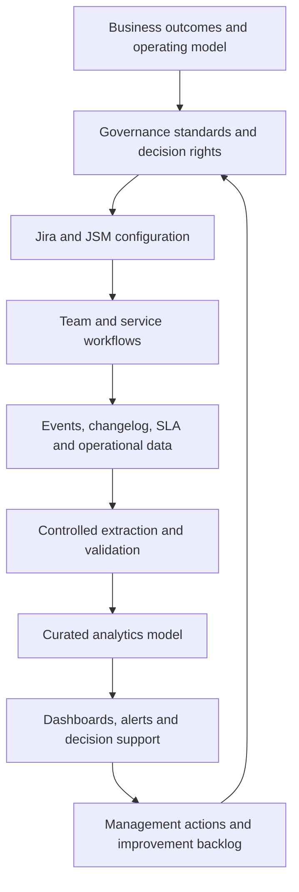

# Enterprise Jira Transformation Reference Architecture

This reference architecture connects governance, platform configuration, operational workflows, analytics, and continuous improvement. It is intentionally product-neutral beyond the Jira and Jira Service Management context.

## Architecture layers

| Layer | Purpose | Core controls |
|---|---|---|
| Experience | User portals, boards, forms, dashboards, and notifications | Accessibility, usability, audience fit |
| Process | Delivery, service, change, release, risk, and financial workflows | Standard lifecycle, entry/exit criteria, exception handling |
| Configuration | Projects, schemes, fields, screens, permissions, automation | Reuse, ownership, naming, change control |
| Integration | APIs, webhooks, CI/CD, identity, observability, finance, data platforms | Authentication, idempotency, retries, rate limits, audit |
| Data | Current state, changelog, snapshots, SLA cycles, deployment and cost events | Quality, lineage, retention, reconciliation |
| Analytics | Semantic models, KPIs, dashboards, forecasts, narratives | Governed definitions, thresholds, freshness, security |
| Governance | Decision rights, standards, approvals, risk, compliance, value realization | RACI, evidence, policy, review cadence |

## End-to-end flow

## Platform zones

### Governed core

Shared enterprise configuration that should be deliberately standardized: identity, permission principles, issue hierarchy, mandatory data, approved workflow patterns, service taxonomy, integration standards, audit controls, and reporting dimensions.

### Controlled extension

Reusable variants permitted for legitimate domain needs. Every extension requires an owner, rationale, impact assessment, lifecycle plan, and retirement criteria.

### Local experimentation

Time-bound, isolated experimentation with no uncontrolled enterprise dependency. Successful patterns must be reviewed before promotion; unsuccessful experiments must be removed.

## Key architecture decisions

1. Which configuration is globally standardized versus locally extensible?
2. What is the canonical work hierarchy and service taxonomy?
3. Which source fields are authoritative for analytics?
4. How is historical state preserved?
5. Which integrations may write back, and under what approval model?
6. How are identities, permissions, secrets, and service accounts governed?
7. What are the recovery, rollback, and continuity expectations?
8. Which decisions require human accountability when AI assistance is used?

## Integration principles

- Prefer documented APIs over screen scraping.
- Use service identities with least privilege.
- Make write operations idempotent where possible.
- Apply pagination, retry with backoff, rate-limit handling, and dead-letter capture.
- Record correlation identifiers and audit events.
- Separate read analytics from write-back automation.
- Validate schema changes before production deployment.
- Provide operational ownership and failure runbooks.

## Non-functional requirements

### Security

Least privilege, separation of duties, secure secret storage, auditability, data minimization, controlled export, and periodic access review.

### Reliability

Defined availability targets, monitored integrations, recoverable ingestion, replay capability, and tested rollback.

### Scalability

Partitioned extraction, incremental processing, representative volume testing, bounded query patterns, and semantic-model optimization.

### Maintainability

Versioned configuration, reusable standards, documented ownership, automated validation, and deprecation pathways.

### Observability

Freshness, completeness, failure, latency, volume, reconciliation, and schema-drift monitoring across the data path.

## Architecture review checklist

- [ ] Business outcomes and critical decisions are explicit.
- [ ] Current and target architecture boundaries are documented.
- [ ] Standardization and extension rules are approved.
- [ ] Identity, permission, and secret controls are defined.
- [ ] Data ownership, lineage, history, and retention are defined.
- [ ] Integration failure and replay behavior are documented.
- [ ] Analytics definitions and reconciliation controls are connected to the source model.
- [ ] Migration, cutover, rollback, and continuity requirements are addressed.
- [ ] Operational ownership and support model are agreed.
- [ ] Technical debt and exception expiry are tracked.