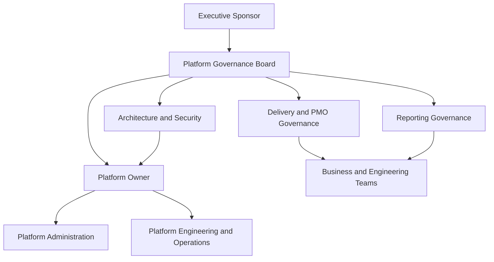

# Enterprise Jira Governance Model

**Version 1.0**  
**Enterprise Program Leadership Series — Volume I**

## Executive Summary

Jira environments do not remain healthy through administration alone. They remain healthy through governance.

Governance defines who owns the platform, who can approve change, which standards apply, when exceptions are justified, how risks are controlled, and how platform health is measured over time. Without these mechanisms, local optimizations accumulate into enterprise complexity: duplicated workflows, uncontrolled custom fields, fragmented reporting, opaque automation, and rising support effort.

This document provides a practical operating model for governing Jira as an enterprise capability rather than as a collection of independently administered projects.

## Why Leadership Should Care

Jira often becomes part of the operational backbone for product delivery, engineering, service management, security, compliance, and executive reporting. Weak governance can therefore affect:

- delivery predictability;
- reporting trust;
- auditability;
- engineering productivity;
- platform reliability;
- change risk;
- administrative cost;
- organizational scalability.

The leadership objective is not to eliminate all customization. It is to ensure that customization is intentional, evidence-based, owned, and sustainable.

## Governance Objectives

A mature governance model should create:

- accountable platform ownership;
- standard configurations and reusable patterns;
- transparent decision rights;
- controlled exceptions;
- secure and auditable administration;
- consistent KPI and reporting definitions;
- measurable platform health;
- predictable change and release management;
- continuous simplification and improvement.

## Governance Principles

### 1. Standardize by Default

Approved shared patterns should be the normal path. Customization should require a documented need that cannot reasonably be met through an existing capability.

### 2. Business Value Before Configuration

Every change should solve a defined problem and identify the expected outcome, owner, impact, and success measure.

### 3. Configure Once, Reuse Many Times

Shared workflows, schemes, templates, and reporting definitions reduce maintenance cost and improve comparability.

### 4. Least Privilege for Administration

Administrative rights should be limited, role-based, reviewed periodically, and traceable to accountable owners.

### 5. Exceptions Need Lifecycles

An exception should have an owner, rationale, review date, and exit condition. Permanent exceptions without review become unmanaged standards.

### 6. Evidence Over Opinion

Decisions should use usage data, dependency analysis, risk, value, and operating impact—not preference alone.

### 7. Governance Must Be Measured

The operating model should track both compliance and outcomes. A process that produces approvals but no simplification or reliability improvement is not effective governance.

## Governance Scope

| Domain | Governs | Typical Accountable Owner |
|---|---|---|
| Platform strategy | Product direction, licensing, roadmap, capacity, architecture | Platform owner |
| Configuration | Workflows, schemes, fields, screens, issue types, templates | Platform administration lead |
| Delivery process | Lifecycle standards, planning models, required controls | PMO or delivery-governance lead |
| Reporting | KPI definitions, dashboards, data quality, executive reporting | Reporting or portfolio-governance lead |
| Automation | Rule standards, ownership, testing, monitoring, lifecycle | Platform engineering lead |
| Security | Access, permissions, audit, segregation of duties | Security owner |
| Integration | APIs, marketplace applications, webhooks, data flows | Enterprise or solution architecture |
| Operations | Support, incidents, changes, releases, health monitoring | Platform operations lead |
| Adoption | Training, communication, user support, feedback | Change or adoption lead |

## Governance Operating Model

### Executive Sponsor

Provides strategic sponsorship, resolves cross-functional conflict, and ensures the platform supports enterprise priorities.

### Platform Governance Board

Approves standards, high-impact changes, exceptions, roadmap priorities, and material risk decisions.

### Platform Owner

Owns platform outcomes, roadmap, health, service model, and governance effectiveness.

### Platform Administration

Implements and maintains approved configuration, documentation, access, and operational controls.

### Delivery and PMO Governance

Defines delivery-process standards, planning and lifecycle controls, and portfolio reporting expectations.

### Architecture and Security

Reviews integration, data, identity, access, resilience, and compliance implications.

### Reporting Governance

Owns KPI definitions, semantic consistency, dashboard standards, and data-quality expectations.

### Business and Engineering Teams

Use approved patterns, identify legitimate gaps, participate in testing, and remain accountable for process adoption.

## Decision Rights Matrix

| Decision | Accountable | Consulted | Required Evidence |
|---|---|---|---|
| New workflow or major workflow change | Governance board | Platform admin, process owner, reporting owner | Business need, reuse analysis, impact, test plan |
| New custom field | Platform owner | Reporting owner, data owner | Existing-field search, data definition, context, owner, retirement condition |
| New issue type | Governance board | PMO, platform admin | Lifecycle need, reporting impact, template assessment |
| New automation rule | Platform owner | Engineering, security as applicable | Owner, trigger scope, failure handling, test evidence, monitoring |
| Permission change | Security owner | Platform owner | Access need, least-privilege review, audit impact |
| Dashboard or KPI standard | Reporting governance | Executive stakeholders, PMO | Definition, source, calculation, owner, quality rule |
| Marketplace application | Platform governance board | Architecture, security, procurement | Value, data access, integration risk, cost, exit plan |
| Migration go/no-go | Program sponsor | Platform owner, business owners, security, operations | Readiness scorecard, open risks, rollback readiness |
| Rollback decision | Named cutover authority | Technical and business leads | Trigger breach, impact assessment, recovery viability |
| Exception approval | Governance board or delegated owner | Affected domain owners | Rationale, risk, duration, owner, review date |

## Change Classification

| Class | Examples | Governance Path |
|---|---|---|
| Standard | Pre-approved template, low-risk configuration within defined guardrails | Logged implementation and validation |
| Normal | Material workflow, field, automation, permission, or integration change | Impact assessment, review, approval, testing |
| Emergency | Urgent change required to restore service or contain material risk | Named emergency authority, expedited control, retrospective review |
| Strategic | Platform architecture, operating model, major application, migration, or enterprise standard | Governance-board decision and executive sponsorship |

## Change Intake Standard

Every request should answer:

1. What problem is being solved?
2. Who experiences the problem and how often?
3. What measurable outcome is expected?
4. Can an approved capability already meet the need?
5. What configurations, reports, integrations, and users are affected?
6. Who owns the change after implementation?
7. How will the change be tested and monitored?
8. What is the rollback or reversal method?
9. Is the change temporary, permanent, or subject to review?

Requests that cannot answer these questions should return to discovery rather than enter implementation.

## Exception Management

Exceptions should be treated as governed debt, not invisible permanence.

Each exception record should include:

- exception identifier;
- requested deviation;
- business rationale;
- affected scope;
- risk and control assessment;
- accountable owner;
- approval authority;
- effective date;
- review date;
- expiration or exit condition;
- compensating controls;
- final disposition.

## Governance Cadence

| Forum or Activity | Recommended Cadence | Purpose |
|---|---|---|
| Platform operational review | Weekly or biweekly | Review incidents, failures, demand, and near-term changes |
| Governance board | Monthly | Decide standards, exceptions, priorities, and material risks |
| Configuration health review | Monthly | Track growth, duplication, ownership, and hygiene |
| Reporting governance review | Monthly or quarterly | Maintain KPI definitions and dashboard trust |
| Access and administrator review | Quarterly | Validate least privilege and ownership |
| Automation lifecycle review | Quarterly | Review failures, unused rules, duplication, and ownership |
| Workflow and field rationalization | Semiannual | Reduce complexity and retire unused configuration |
| Platform strategy review | Annual | Reconfirm roadmap, architecture, service model, and investment |

Cadence should be adjusted to platform scale, regulatory obligations, and change volume.

## Governance Scorecard

| Dimension | Example KPI | Desired Direction |
|---|---|---|
| Standardization | Percentage of projects using approved templates | Increase |
| Reuse | Shared workflow and scheme adoption | Increase |
| Complexity | Active workflows and custom fields per active project | Decrease or stabilize |
| Ownership | Percentage of critical assets with accountable owners | Increase toward 100% |
| Exceptions | Open exceptions beyond review date | Decrease toward zero |
| Automation | Successful executions and rules with active owners | Increase |
| Security | Privileged accounts without current justification | Decrease toward zero |
| Data quality | Required-field completeness and KPI reconciliation accuracy | Increase |
| Change quality | Post-change incidents and rollback rate | Decrease |
| Responsiveness | Governance decision lead time | Improve without weakening controls |
| Simplification | Retired unused or duplicate configurations | Increase |
| Adoption | Compliance with standard workflows and reporting definitions | Increase |

## Governance Maturity Model

| Level | Characteristics | Priority |
|---|---|---|
| 1 — Ad Hoc | Decentralized administration, undocumented decisions, inconsistent reporting | Establish ownership and inventory |
| 2 — Defined | Basic standards, roles, and intake exist but adoption is uneven | Enforce core controls and reusable patterns |
| 3 — Governed | Decision rights, approvals, exceptions, and recurring reviews are active | Improve compliance and lifecycle management |
| 4 — Measured | Health, risk, value, and decision performance are monitored | Shift from reactive to proactive governance |
| 5 — Optimized | Analytics, automation, and continuous improvement prevent regression | Maximize value while controlling complexity |

## Common Anti-Patterns

- allowing team-specific workflows without enterprise impact review;
- creating custom fields for temporary reporting needs;
- granting broad administrator access for convenience;
- approving automation without ownership or failure monitoring;
- publishing dashboards without controlled KPI definitions;
- treating the governance board as a meeting rather than a decision body;
- measuring request volume but not complexity reduction or outcome improvement;
- approving exceptions without review dates or exit plans;
- delaying governance until after a migration;
- using AI recommendations as decisions without explainability and accountable approval.

## AI Opportunities and Controls

AI can strengthen governance by assisting with:

- identifying semantically similar fields and workflows;
- detecting unused or rapidly growing configuration;
- summarizing change impact and dependency evidence;
- flagging governance drift;
- drafting decision briefs and executive summaries;
- checking requests for missing ownership, testing, or rollback details;
- prioritizing rationalization candidates.

Required controls include:

- approved data boundaries;
- role-based access;
- human validation;
- explainable recommendations;
- retained decision evidence;
- protection against automatic high-impact changes;
- periodic accuracy and bias review.

## Definition of Effective Governance

Governance is effective when:

- teams use shared standards by default;
- exceptions are visible, temporary, and owned;
- platform complexity grows slower than organizational demand;
- changes are predictable, testable, reversible, and auditable;
- reporting remains consistent and trusted;
- administrative rights and critical assets have clear owners;
- leaders can see platform risk, health, and value through evidence;
- governance enables delivery rather than creating uncontrolled delay.

## Related Documents

- [Enterprise Jira Transformation Framework](Enterprise-Jira-Transformation-Framework.md)
- [Consolidation Playbook](../playbooks/consolidation-playbook.md)
- [Migration Runbook](../playbooks/migration-runbook.md)
- [Cutover Checklist](../runbooks/cutover_checklist.md)
- [Rollback Plan](../runbooks/rollback_plan.md)
- [Portfolio Data Policy](../PORTFOLIO_DATA_POLICY.md)