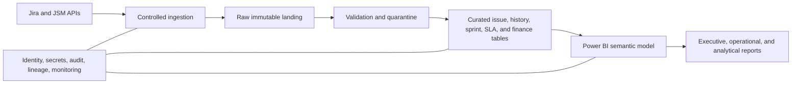

# Power BI Implementation Guide for Enterprise Jira Analytics

This guide defines a secure, scalable baseline for Jira and Jira Service Management analytics in Power BI. It is technology guidance, not a substitute for local architecture, security, and licensing review.

## Recommended architecture

## Core design principles

1. Use a dedicated service identity rather than a personal account.
2. Separate extraction, storage, transformation, semantic modelling, and presentation.
3. Preserve issue changelog or periodic snapshots for historical-state analysis.
4. Keep raw data immutable and rerunnable.
5. Quarantine invalid records instead of silently dropping them.
6. Reconcile source counts and values at every layer.
7. Apply least privilege, secret rotation, audit logging, and controlled write-back.
8. Treat the semantic model as a governed product with named owners.

## Suggested semantic model

### Dimensions

- Date
- Project
- Issue type
- Status and status category
- Priority
- Team or functional group
- Assignee surrogate
- Reporter surrogate where permitted
- Sprint
- Release or fix version
- Service, product, pillar, and environment
- SLA definition
- Cost category and benefit type

### Facts

- Issue current snapshot
- Issue daily snapshot
- Status transition history
- Sprint commitment snapshot
- Sprint completion snapshot
- SLA cycle
- Deployment or release event
- Incident and change event
- Cost opportunity and realized benefit
- Governance decision and exception

## Required grains

Every fact table must state its grain explicitly. Examples:

- one row per issue in the current snapshot;
- one row per issue per day in the daily snapshot;
- one row per status transition;
- one row per issue-sprint membership event;
- one row per SLA cycle;
- one row per approved financial benefit event.

Mixing grains without explicit bridge logic is a common cause of inflated counts and values.

## Incremental refresh

Use incremental refresh for large issue, changelog, snapshot, and SLA tables. Define:

- immutable historical partitions;
- a configurable refresh window for recently changed records;
- late-arriving update handling;
- deletion and archival reconciliation;
- retry, watermark, and replay behavior.

## Measure standards

Measures should:

- use a central measures table;
- have business-readable names and descriptions;
- reference governed KPI definitions;
- define blank versus zero behavior;
- use explicit numerator and denominator measures;
- avoid calculated columns where a measure or transformation is more appropriate;
- include validation totals and diagnostic measures.

## RAG implementation

Keep target and threshold values in governed configuration tables where practical. A RAG measure must distinguish:

- green performance;
- amber warning;
- red breach;
- unavailable or insufficient data;
- stale or unreconciled data;
- approved manual override.

Do not encode missing data as green.

## Security

- Use least-privilege source access.
- Store secrets in an approved secret store.
- Apply row-level security only after validating all relationship paths.
- Avoid exposing user-level or sensitive incident data in executive models.
- Restrict export, build, share, and reshare permissions.
- Review personal data retention and masking requirements.
- Log refresh, publication, and administrative activity.

## Performance baseline

- Prefer a star schema.
- Reduce high-cardinality text in fact tables.
- Use integer surrogate keys.
- Disable automatic date/time in managed enterprise models.
- Limit bidirectional relationships and many-to-many relationships.
- Keep report pages focused on named decisions.
- Validate performance using representative production-scale synthetic data.

## Reconciliation controls

At minimum, validate:

1. total issues by project and issue type;
2. open and resolved totals by status category;
3. created and resolved cohorts by period;
4. sprint membership and closing scope;
5. SLA eligible, met, breached, and ongoing cycles;
6. financial totals by benefit type and approval state;
7. transition counts and snapshot continuity;
8. API extraction completeness against source pagination totals.

## Deployment lifecycle

Use separate development, test, and production workspaces. Changes should pass source validation, model tests, metric reconciliation, visual acceptance, security review, and business-owner approval before production publication.

## Baseline acceptance criteria

- Architecture and ownership are approved.
- The model grain and relationships are documented.
- Historical-state requirements are supported.
- Refresh is monitored and recoverable.
- Published KPIs reconcile to governed definitions.
- Security and export controls are tested.
- Performance is validated at representative scale.
- Runbooks exist for refresh failure, schema change, credential rotation, and source outage.