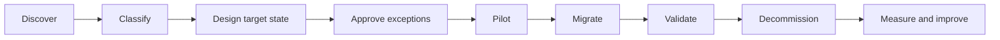

# Enterprise Jira Consolidation Playbook

**Version 1.0**  
**Enterprise Program Leadership Series — Volume I**

## Executive Summary

Jira consolidation is not simply the reduction of projects, workflows, fields, or schemes. It is an enterprise operating-model decision that determines how consistently teams plan work, govern delivery, measure outcomes, and maintain the platform over time.

This playbook provides a structured method for reducing configuration complexity while protecting business continuity, auditability, reporting integrity, and team productivity.

## Outcomes

A successful consolidation should:

- reduce duplicated configuration;
- improve workflow and reporting consistency;
- establish clear ownership and decision rights;
- lower administrative effort;
- improve data quality and auditability;
- preserve valid business differences;
- create a scalable foundation for automation and analytics.

## Guiding Principles

1. **Standardize by default.** Customization requires a documented business reason.
2. **Consolidate capability, not merely objects.** Evaluate the business process behind each configuration.
3. **Preserve evidence.** Decisions, mappings, approvals, and validation results must remain traceable.
4. **Protect continuity.** No consolidation is successful if it disrupts critical delivery or service operations.
5. **Measure before and after.** Complexity reduction must be demonstrated with objective metrics.

## Scope Model

Assess consolidation across six domains:

| Domain | Typical objects | Primary question |
|---|---|---|
| Projects | company-managed and team-managed projects | Can teams share a common operating model? |
| Workflows | statuses, transitions, validators, conditions | Which lifecycle differences are truly material? |
| Fields | global and context-specific fields | Is the data unique, reusable, or redundant? |
| Schemes | issue type, screen, permission, notification schemes | Can a shared scheme meet the need safely? |
| Automation | global and project rules | Can duplicate rules be centralized and governed? |
| Reporting | filters, dashboards, KPIs | Are definitions consistent and trusted? |

## Consolidation Lifecycle

## Phase 1 — Discovery

Build a complete inventory before recommending change.

Minimum inventory:

- project purpose and owner;
- active users and recent activity;
- issue types and workflows;
- fields, screens, and schemes;
- automation rules and integrations;
- filters, boards, and dashboards;
- permission and notification dependencies;
- regulatory, audit, or retention requirements.

### Discovery Output

Create a baseline register containing:

| Field | Example placeholder |
|---|---|
| Project key | `<YOUR_PROJECT_KEY>` |
| Business owner | `<BUSINESS_OWNER>` |
| Platform owner | `<PLATFORM_OWNER>` |
| Workflow | `<WORKFLOW_NAME>` |
| Scheme | `<SCHEME_NAME>` |
| Integration | `<INTEGRATION_NAME>` |
| Disposition | Retain / Merge / Retire / Redesign |

## Phase 2 — Classification

Classify each object using evidence rather than preference.

| Classification | Use when |
|---|---|
| Retain | The capability is unique, current, governed, and justified. |
| Merge | Multiple objects provide substantially the same capability. |
| Redesign | The need is valid, but the current implementation is unsustainable. |
| Retire | The object is unused, obsolete, duplicated, or unsupported. |
| Quarantine | Ownership, usage, or risk is unclear and requires investigation. |

## Phase 3 — Target-State Design

Define the future-state model before changing production configuration.

The target state should include:

- standard project patterns;
- approved workflow families;
- canonical issue types;
- field taxonomy and naming rules;
- shared scheme strategy;
- automation ownership model;
- standard KPI definitions;
- exception criteria;
- support and review cadence.

## Decision Framework

| Decision | Prefer consolidation when | Preserve separation when |
|---|---|---|
| Projects | teams share lifecycle, permissions, and reporting | legal, security, or operating models materially differ |
| Workflows | status meaning and controls are equivalent | compliance or service commitments require unique states |
| Fields | data definition and purpose are identical | context, datatype, or stewardship differs |
| Schemes | reuse reduces complexity without access risk | isolation is required for permission or notification control |
| Automation | logic and trigger intent are reusable | local timing, ownership, or risk differs materially |

## Exception Governance

Every exception should document:

- the business requirement;
- why the standard cannot satisfy it;
- risk of approving the exception;
- owner and review date;
- measurable success criteria;
- retirement or reassessment trigger.

Exceptions without owners or review dates become permanent technical debt.

## Pilot Strategy

Select a pilot that is representative but recoverable.

A good pilot has:

- engaged business and technical owners;
- moderate configuration complexity;
- known integrations;
- measurable baseline data;
- a viable rollback route;
- enough volume to reveal operational issues.

Avoid using either the simplest project or the most critical project as the first pilot.

## Validation Model

Validate at four levels:

1. **Configuration:** workflows, fields, schemes, permissions, and automation behave as designed.
2. **Data:** issue counts, history, links, attachments, users, and timestamps reconcile.
3. **Operations:** teams can plan, execute, report, and support work without material disruption.
4. **Leadership:** KPI continuity, governance controls, and risk visibility are preserved or improved.

## Success Metrics

| Metric | Direction |
|---|---|
| Active workflow count | Down |
| Duplicate field count | Down |
| Shared scheme adoption | Up |
| Automation failure rate | Down |
| Administrative effort | Down |
| Standard dashboard adoption | Up |
| Data-quality exceptions | Down |
| User support demand after stabilization | Down |

## Common Failure Modes

- consolidating without dependency mapping;
- equating fewer objects with better design;
- ignoring team change impact;
- migrating obsolete configuration;
- approving exceptions without expiry;
- decommissioning before evidence is retained;
- measuring completion instead of outcomes.

## AI Enablement

AI can assist with:

- clustering similar workflows and fields;
- detecting naming and semantic duplication;
- summarizing automation logic;
- identifying dependency patterns;
- drafting mapping recommendations;
- comparing pre- and post-change inventories;
- generating leadership summaries.

AI recommendations must be reviewed by accountable human owners before production change.

## Definition of Done

Consolidation is complete when:

- approved target-state standards are implemented;
- all retained exceptions are documented and owned;
- migration and validation evidence is stored;
- obsolete objects are safely decommissioned;
- baseline and outcome metrics are compared;
- operational ownership has transferred;
- a continuous governance cadence is active.

## Related Documents

- [Enterprise Jira Transformation Framework](../docs/Enterprise-Jira-Transformation-Framework.md)
- [Enterprise Jira Governance Model](../docs/Governance-Model.md)
- [Migration Runbook](migration-runbook.md)
- [Cutover Checklist](../runbooks/cutover_checklist.md)
- [Rollback Plan](../runbooks/rollback_plan.md)
