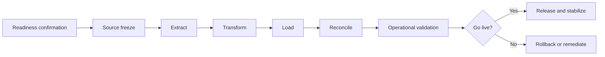

# Enterprise Jira Migration Runbook

**Version 1.0**  
**Enterprise Program Leadership Series — Volume I**

## Purpose

This runbook defines the controlled execution of an enterprise Jira migration from an approved source state to an approved target state. It is designed to make migration activity repeatable, auditable, measurable, and recoverable.

## Executive Objective

The migration must move approved scope without compromising data integrity, access control, integrations, reporting continuity, or operational readiness.

## Entry Criteria

Do not begin execution until all criteria are met:

- source and target inventories are approved;
- mapping decisions are complete;
- target configuration is deployed and tested;
- owners and decision rights are confirmed;
- migration tooling has been validated;
- backup and recovery evidence exists;
- reconciliation queries are prepared;
- communication templates are approved;
- rollback criteria are agreed;
- cutover governance is active.

## Roles

| Role | Accountability |
|---|---|
| Executive sponsor | Owns business outcome and escalated decisions |
| Program lead | Coordinates scope, milestones, risk, and communications |
| Migration lead | Owns technical execution and migration evidence |
| Platform owner | Approves Jira configuration and access changes |
| Data-validation lead | Owns reconciliation and defect classification |
| Integration owner | Validates upstream and downstream services |
| Business owner | Confirms operational acceptance |
| Communications lead | Coordinates stakeholder notices and status updates |

## Migration Strategy Decision

| Strategy | Best suited for | Primary risk |
|---|---|---|
| Big bang | small, low-complexity scope with a short outage tolerance | concentrated failure impact |
| Phased | large or segmented environments | extended coexistence and mapping complexity |
| Pilot then waves | enterprise transformation with reusable patterns | pilot may not expose every edge case |
| Parallel operation | high-criticality processes requiring evidence before switch | duplicate operations and reconciliation effort |

## Execution Stages

## Stage 1 — Readiness Confirmation

Record:

- migration ID: `<MIGRATION_ID>`;
- approved scope: `<APPROVED_SCOPE>`;
- source: `<SOURCE_ENVIRONMENT>`;
- target: `<TARGET_ENVIRONMENT>`;
- planned start: `<START_DATE_TIME>`;
- decision authority: `<GO_NO_GO_OWNER>`;
- rollback deadline: `<ROLLBACK_DECISION_TIME>`.

Conduct a formal readiness review covering:

- unresolved critical defects;
- backup integrity;
- target capacity;
- credentials and access;
- integration availability;
- vendor or support coverage;
- stakeholder attendance;
- communication readiness.

## Stage 2 — Source Freeze

- announce the freeze;
- stop non-essential configuration changes;
- capture final source inventory;
- record source issue counts and object counts;
- preserve automation state;
- confirm no unauthorized changes occurred after baseline capture.

Any emergency change during the freeze must be logged, reviewed, and reflected in migration scope.

## Stage 3 — Extract

Capture all approved data and configuration required for migration.

At minimum verify:

- issues and hierarchy;
- comments and history;
- users and groups;
- attachments;
- links and relationships;
- statuses and resolutions;
- versions and components;
- boards, filters, and dashboards where in scope;
- automation and integration references.

Generate checksums, counts, or equivalent evidence where the migration method supports them.

## Stage 4 — Transform

Apply only approved mappings.

Typical transformations include:

- project-key mapping;
- issue-type mapping;
- status and resolution mapping;
- user identity mapping;
- field normalization;
- option-value standardization;
- permission and role mapping;
- link-type or hierarchy conversion.

Every rejected or unmapped record must enter an exception register.

## Stage 5 — Load

- load in the approved sequence;
- preserve dependency order;
- monitor errors and throughput;
- stop if a critical threshold is crossed;
- retain tool logs and batch identifiers;
- do not rerun failed batches without duplicate-control checks.

Recommended sequence:

1. foundational configuration;
2. users, groups, and roles;
3. projects and schemes;
4. issues and hierarchy;
5. comments, links, and attachments;
6. boards, filters, and dashboards;
7. automation and integrations.

## Stage 6 — Reconciliation

Reconcile source, migration output, and target.

| Control | Expected result |
|---|---|
| Issue count | matches approved scope, less documented exclusions |
| Parent-child relationships | preserved or correctly remapped |
| Status and resolution | conforms to approved mapping |
| User ownership | active users mapped; exceptions documented |
| Attachments | accessible and associated correctly |
| Comments and history | present according to migration capability |
| Permissions | authorized users retain appropriate access |
| Automation | enabled only after validation |
| Integrations | authenticated, connected, and processing correctly |

## Defect Severity

| Severity | Definition | Default decision |
|---|---|---|
| Critical | data loss, security exposure, inaccessible core service, or unrecoverable corruption | stop and evaluate rollback |
| High | material business process or reporting failure without acceptable workaround | hold go-live |
| Medium | limited impact with controlled workaround | remediate under approved plan |
| Low | cosmetic or non-blocking issue | move to stabilization backlog |

## Stage 7 — Operational Validation

Business owners validate representative scenarios:

- create and update work;
- move items through approved workflows;
- search and filter;
- plan through boards or backlogs;
- view dashboards and reports;
- execute approval or service workflows;
- trigger approved integrations;
- verify notifications and access boundaries.

## Go/No-Go Criteria

Approve go-live only when:

- no open critical defects exist;
- high-severity defects meet agreed disposition;
- reconciliation thresholds are met;
- security and permission validation passes;
- critical integrations pass;
- business owners provide acceptance;
- rollback remains viable until the decision is recorded.

## Stabilization

For `<STABILIZATION_PERIOD>` after release:

- monitor error rates and support demand;
- track data-quality exceptions;
- review automation failures;
- compare transaction and activity volumes;
- hold daily operational reviews where warranted;
- publish leadership status using agreed KPIs.

## Exit Criteria

The migration runbook is complete when:

- the go-live decision and evidence are recorded;
- reconciliation results are approved;
- exceptions have owners and due dates;
- support ownership is transferred;
- temporary access is removed;
- the source environment is retained or decommissioned per policy;
- lessons learned are documented.

## Related Documents

- [Consolidation Playbook](consolidation-playbook.md)
- [Cutover Checklist](../runbooks/cutover_checklist.md)
- [Rollback Plan](../runbooks/rollback_plan.md)
- [Enterprise Jira Governance Model](../docs/Governance-Model.md)
