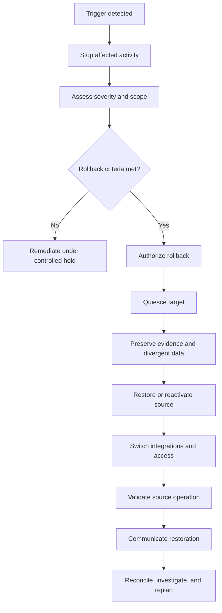

# Enterprise Jira Rollback Plan

**Version 1.0**  
**Enterprise Program Leadership Series — Volume I**

## Purpose

This plan defines how to restore a controlled, supportable operating state when a Jira migration or cutover cannot meet approved go-live criteria. Rollback is a governed business-continuity decision, not an improvised technical reaction.

## Executive Principle

A rollback is successful when it protects data integrity, security, operational continuity, and stakeholder trust—even if it delays the transformation.

## Rollback Record

| Field | Value |
|---|---|
| Rollback ID | `<ROLLBACK_ID>` |
| Related cutover | `<CUTOVER_ID>` |
| Source environment | `<SOURCE_ENVIRONMENT>` |
| Target environment | `<TARGET_ENVIRONMENT>` |
| Decision deadline | `<ROLLBACK_DECISION_TIME>` |
| Decision owner | `<ROLLBACK_AUTHORITY>` |
| Technical lead | `<TECHNICAL_LEAD>` |
| Communications lead | `<COMMUNICATIONS_LEAD>` |

## Preconditions

Rollback must be designed and tested before cutover begins.

Confirm:

- source backup and recovery evidence exists;
- source and target recovery points are timestamped;
- post-freeze changes can be identified;
- target writes can be stopped safely;
- integration switchback steps are documented;
- user communication templates are approved;
- decision authority is available;
- maximum rollback window is understood;
- reconciliation and validation scripts are ready.

## Rollback Triggers

Rollback evaluation is mandatory when any of the following occurs:

- confirmed data loss or corruption;
- unauthorized access or security-boundary failure;
- critical business workflow unavailable;
- material reconciliation failure outside approved tolerance;
- critical integration failure without safe workaround;
- migration process cannot complete within the decision window;
- performance or stability prevents normal operation;
- recovery confidence declines below the approved threshold.

## Decision Matrix

| Condition | Continue remediation | Hold go-live | Roll back |
|---|---:|---:|---:|
| Low-severity cosmetic defect | Yes | No | No |
| Contained defect with tested workaround | Yes | Possible | No |
| High-severity process failure | No | Yes | Possible |
| Critical data-integrity failure | No | No | Yes |
| Security exposure | No | No | Yes |
| Rollback window nearly expired | Only by authority | Yes | Usually |
| Source restoration is no longer viable | Escalate | Yes | Not possible without alternate recovery |

## Decision Inputs

The rollback authority must consider:

- business impact of staying live;
- business impact of reverting;
- defect severity and blast radius;
- data divergence since source freeze;
- recoverability of source and target;
- time remaining in rollback window;
- confidence in remediation duration;
- security, legal, regulatory, and contractual implications;
- support capacity and stakeholder readiness.

## Rollback Workflow

## Phase 1 — Contain

- pause migration or target activity;
- prevent additional user and integration writes where safe;
- preserve logs, timestamps, screenshots only if fully sanitized, and error evidence;
- identify the last known good recovery point;
- classify the incident and affected scope;
- start the rollback decision clock.

## Phase 2 — Authorize

Record:

- trigger and severity;
- evidence reviewed;
- alternatives considered;
- business and technical recommendation;
- decision and authority;
- timestamp;
- known consequences and follow-up obligations.

No rollback should begin without explicit authorization unless the approved plan delegates automatic action for a predefined safety trigger.

## Phase 3 — Preserve Divergent Data

Before reverting, capture target-side activity generated after source freeze.

Examples:

- newly created issues;
- comments and attachments;
- workflow transitions;
- ownership changes;
- approvals;
- integration events;
- audit records.

Store this material in a controlled exception set for later reconciliation. Do not overwrite it blindly into the restored source.

## Phase 4 — Restore Source Service

- verify source infrastructure and application health;
- restore the approved backup if required;
- re-enable source access in a controlled sequence;
- reinstate required automation;
- restore user groups and permissions;
- verify license and capacity readiness;
- validate time-sensitive jobs and queues.

## Phase 5 — Switch Back Integrations

For each integration:

- stop or isolate target processing;
- rotate or revoke temporary credentials where required;
- restore source endpoint configuration;
- validate authentication;
- process a controlled test transaction;
- monitor duplicates, gaps, and retries;
- obtain owner sign-off.

## Phase 6 — Validate Restored Operations

Validate at minimum:

- users can authenticate and access authorized scope;
- critical workflows function;
- issues, history, links, and attachments are available;
- boards, filters, and dashboards load;
- critical automation operates correctly;
- integrations process expected traffic;
- security boundaries are intact;
- reporting and leadership KPIs are available.

## Phase 7 — Communicate

Issue stakeholder communication that states:

- the rollback decision;
- current service state;
- confirmed user impact;
- required user action, if any;
- handling of work entered during the cutover window;
- support route;
- next update cadence;
- when a new migration plan will be issued, without promising an unapproved date.

## Post-Rollback Reconciliation

Create a reconciliation plan for divergent data.

| Data category | Volume | Proposed treatment | Owner | Approval |
|---|---:|---|---|---|
| New issues | `<COUNT>` | manual or controlled import | `<OWNER>` | Pending |
| Comments | `<COUNT>` | append after validation | `<OWNER>` | Pending |
| Attachments | `<COUNT>` | verify and relink | `<OWNER>` | Pending |
| Workflow changes | `<COUNT>` | review individually | `<OWNER>` | Pending |
| Integration events | `<COUNT>` | replay with duplicate control | `<OWNER>` | Pending |

## Exit Criteria

Rollback is complete when:

- source service is stable and accepted;
- access and security validation pass;
- critical integrations are restored;
- divergent data is preserved and owned;
- stakeholder communication is complete;
- incident and decision evidence is archived;
- temporary target access is disabled or controlled;
- root-cause review is scheduled;
- re-entry criteria for a future migration are documented.

## Post-Rollback Review

The review should answer:

1. Which assumption failed?
2. Which control detected the problem?
3. Was the decision timely?
4. Did the rollback behave as rehearsed?
5. What data divergence occurred?
6. Which entry criteria must change?
7. Which test, automation, or monitoring capability must improve?
8. What evidence is required before another attempt?

## Common Failure Modes

- waiting until the rollback window has expired;
- treating rollback as failure rather than risk control;
- failing to preserve target-side writes;
- switching integrations without duplicate protection;
- restoring service without business validation;
- communicating optimism instead of confirmed facts;
- attempting another cutover before correcting entry criteria.

## Related Documents

- [Cutover Checklist](cutover_checklist.md)
- [Migration Runbook](../playbooks/migration-runbook.md)
- [Consolidation Playbook](../playbooks/consolidation-playbook.md)
- [Enterprise Jira Governance Model](../docs/Governance-Model.md)
